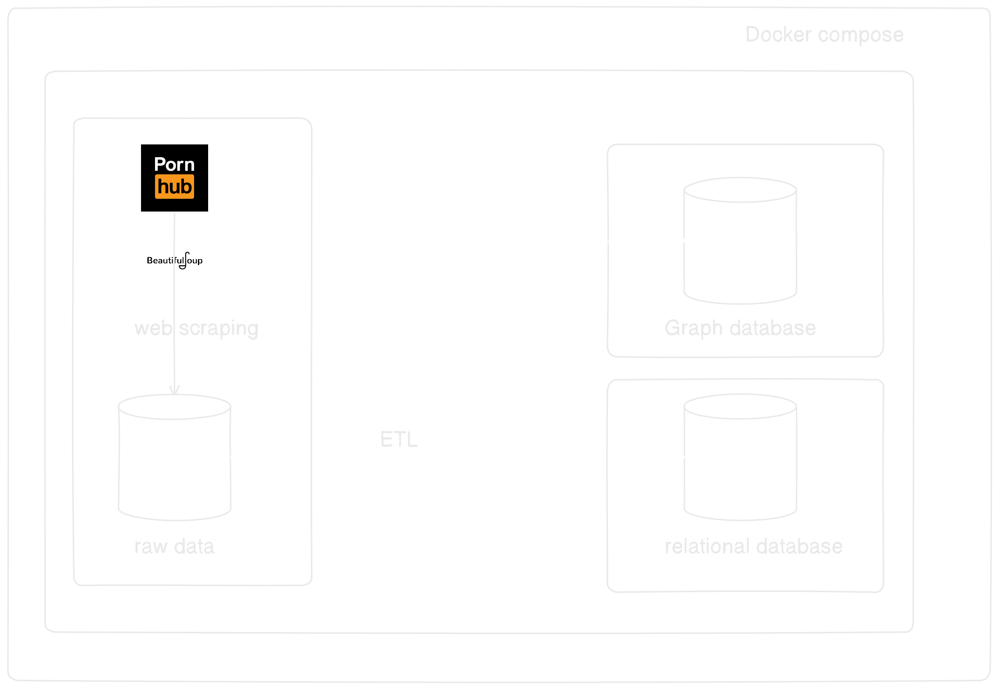

# Project made for my Master Degree thesis
The main objective of thesis is to presents benefits of graph databases and compare it traditional databases. Reason of using Pornhub as example is ability track social connections between pornstars/model.It makes possible to analize stars as social network and changes way as we search for videos

### TO DO LIST:
- [x] Initialize Docker and all needed images
- [x] Prepare scraper
- [ ] Prepare ETL dag for Postgresql(Scala ver/learning purposes)
- [ ] Prapere ETL dag for Neo4j
  
**Additional**  
- [ ] Make python version for Postgresql implementation 
- [ ] Make Scala vestion for Neo4j implementation
  
### Architecture

### Database model
TBD

### Graph model
TBD